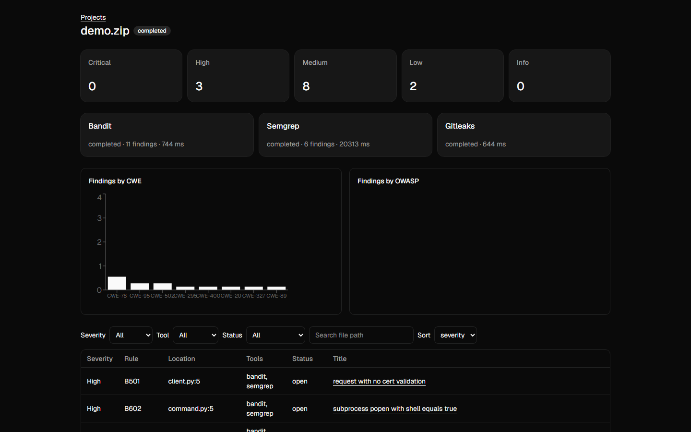
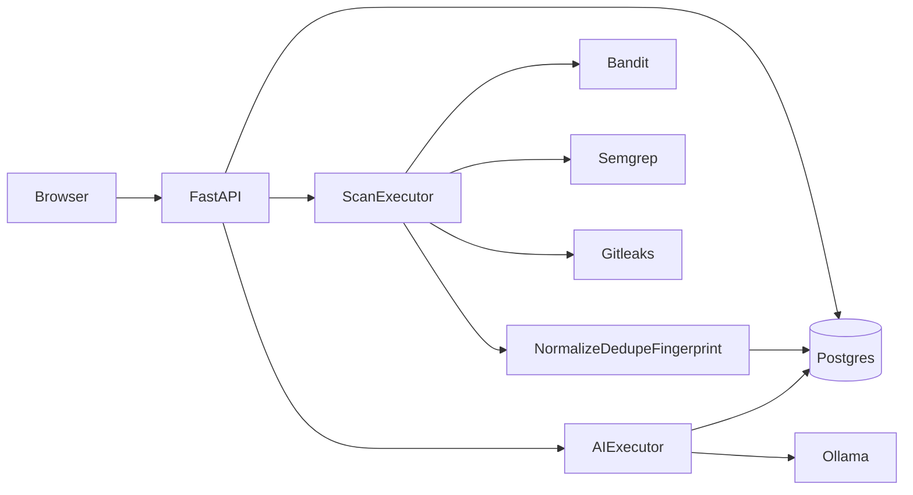

# Panoptes



AI-assisted code vulnerability scanner. You register, create a project, and
either upload a zip or clone a public GitHub or GitLab repository. Panoptes runs
Bandit, Semgrep, and Gitleaks, merges duplicate findings, and labels them with
CWE and OWASP Top 10:2025. A local Ollama model explains findings and suggests
fixes on demand.

**The LLM explains; it never decides severity, CWE, or whether something is a
vulnerability.** Those values come from the scanners. The explanation table has
no columns for them, so a hostile or confused model response has nowhere to
persist a changed verdict.

## Run

```bash
cp .env.example .env
docker compose up --build
docker compose exec ollama ollama pull qwen2.5-coder:7b
```

- API: http://localhost:8000/health
- UI: http://localhost:5173
- Ollama: http://localhost:11434

The Ollama model is not pulled automatically because it is several gigabytes.

For a demo walk-through see [docs/DEMO.md](docs/DEMO.md). Seed a screenshot
account with `python scripts/seed_demo.py`.

## Architecture



The spec asked for `docs/architecture.png`. The diagram is Mermaid in this
README so GitHub can render it and it stays reviewable in git. A PNG can be
exported from the same source later if a slide needs it.

## How a scan runs

A scan is queued, then picked up by a pool of two worker threads. The code is
extracted or cloned into a temporary directory, and the three scanners run one
after another. If one of them times out or crashes, its row is marked and the
scan finishes as `partial` with whatever the others found. The scan is `failed`
only when none of them finish, or when the archive or the URL is rejected.
OWASP labels come from a static CWE table for the 2025 edition (`A05:2025 -
Injection`, never a bare `A05`). A CWE that is not in that table stays
unlabelled.

Bandit and Semgrep findings are merged when they share a file, a starting line,
and a CWE. Gitleaks findings are never merged. If the two tools disagree about
the CWE, both findings stay: dropping one would hide a result, and merging them
would claim they are the same bug.

On [PyGoat](https://github.com/aditya-bhatia/PyGoat) this pipeline produced 65
Bandit + 83 Semgrep + 10 Gitleaks = 158 raw findings, 0 exact duplicates dropped
inside Semgrep, 8 Bandit/Semgrep merges, and 150 stored rows:
`158 - 0 - 8 = 150`.

## Fingerprinting

A finding's identity is `sha256(relative path + rule id + snippet + occurrence)`.
The line number is not included, so adding an import does not make every finding
look new. The snippet has its whitespace removed, so reformatting does not
either. `occurrence` is the Nth identical snippet in that file (the first is 0).

## Comparison and carry-over

Pick two finished scans of the same project. **Fixed**, **New**, and **Still
Open** are fingerprint set difference: vanished, appeared, and present in both.
A finding marked `false_positive` or `accepted_risk` is copied onto the next
finished scan of that project only when the fingerprint matches exactly. The
copy writes a history row attributed to the original user, with the original
reason, labelled in the UI as carried over from the previous scan. `fixed` is
not copied, so a regression comes back as `open`. Changing the flagged line
changes the fingerprint, so a suppression does not follow an edited bug.

## AI explanations

Opening a finding queues one explanation on a dedicated single-worker executor.
The API returns immediately with `202`, and the page polls every two seconds
until the row is `completed` or `failed`. A cached result with the same finding
fingerprint, model name, and prompt version returns immediately with `200`.
Explanations are generated only when opened.

Source code is untrusted prompt data. Panoptes places it between explicit
delimiters, tells the model never to obey instructions inside it, and validates
the JSON response before storing it. Gitleaks findings never reach Ollama and
receive fixed guidance instead.

If Ollama is down, times out, or returns invalid JSON, the finding remains fully
available and the page offers Retry. Each successful call records latency,
prompt tokens, and completion tokens. On this development machine,
`qwen2.5-coder:7b` took 67.4 seconds for the prompt-injection sample (231 prompt
tokens, 200 completion tokens) and 52.1 seconds for a second finding (219 prompt
tokens, 193 completion tokens): 59.8 seconds average across the two calls. These
are small local measurements, not a benchmark.

## Dashboard and finding status

The projects page shows per-user counts, including average AI latency. The scan
page shows severity counts, findings by CWE and OWASP category, and a table that
can be filtered by severity, tool, status, and file path. Opening a finding
shows the code with the flagged lines marked, the official CWE and OWASP
references, and the suggested fix as a line diff. Model output is rendered as
text. A finding can be marked open, fixed, false positive, or accepted risk. A
false positive requires a reason, and every change is stored with the user and
the time. There is no way to edit or delete that history.

## Limitations

- CPU inference for `qwen2.5-coder:7b` is slow: about a minute per explanation
  on this machine. Open findings once before a demo so the cache is warm.
- The model can still write a plausible but wrong explanation. Review is
  required; the scanners still own the verdict.
- Login, scan, and AI rate limits live in process memory and reset on restart.
- Carry-over looks only at the previous finished scan of the same project, not
  the whole history of the project.
- A `partial` scan skews comparison: a missing tool's findings look Fixed.
- Git clone still has a residual DNS-rebinding risk described in
  [SECURITY.md](SECURITY.md).
- There is no password reset or email verification.

## Layout

- `backend/` — FastAPI application
- `frontend/` — React + Vite application
- `scripts/seed_demo.py` — demo account and two scans
- `docs/DEMO.md` — three-minute demo script
- `docker-compose.yml` — db, backend, frontend, ollama
